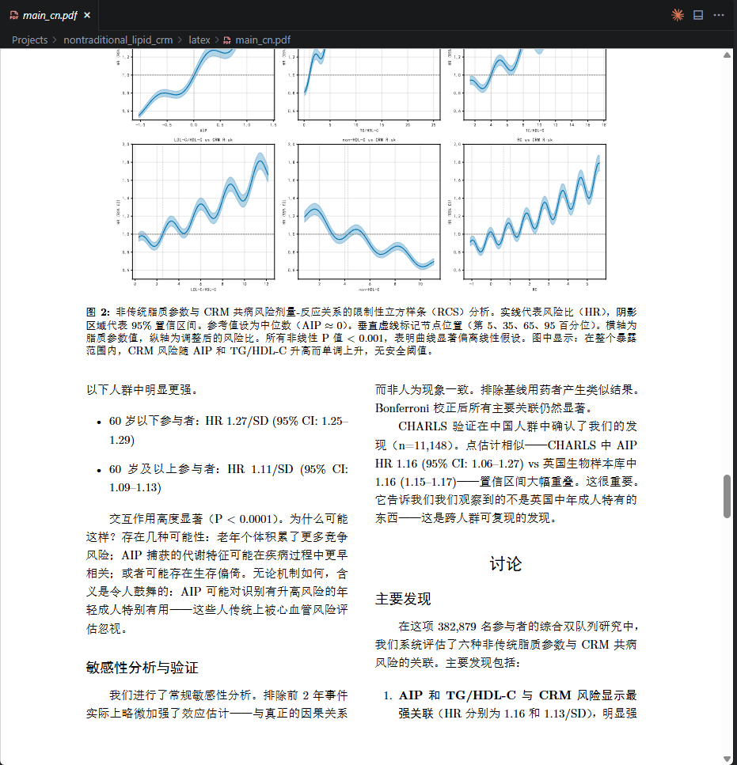
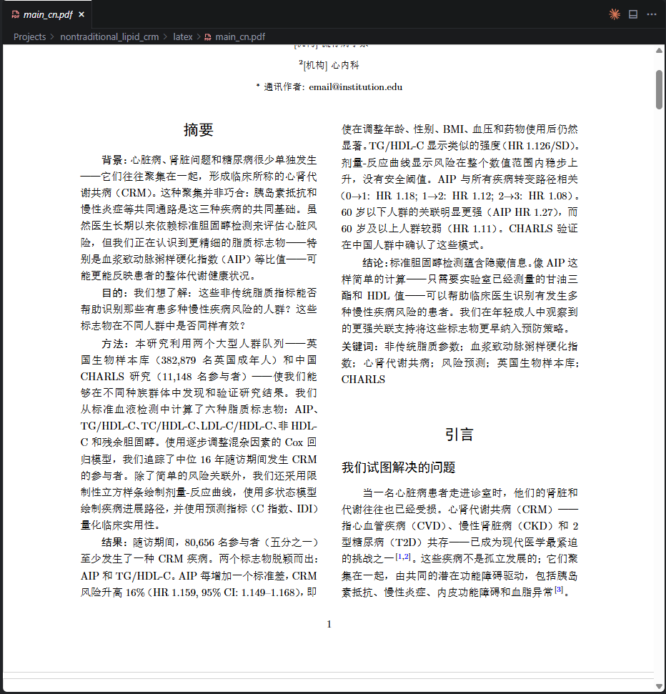
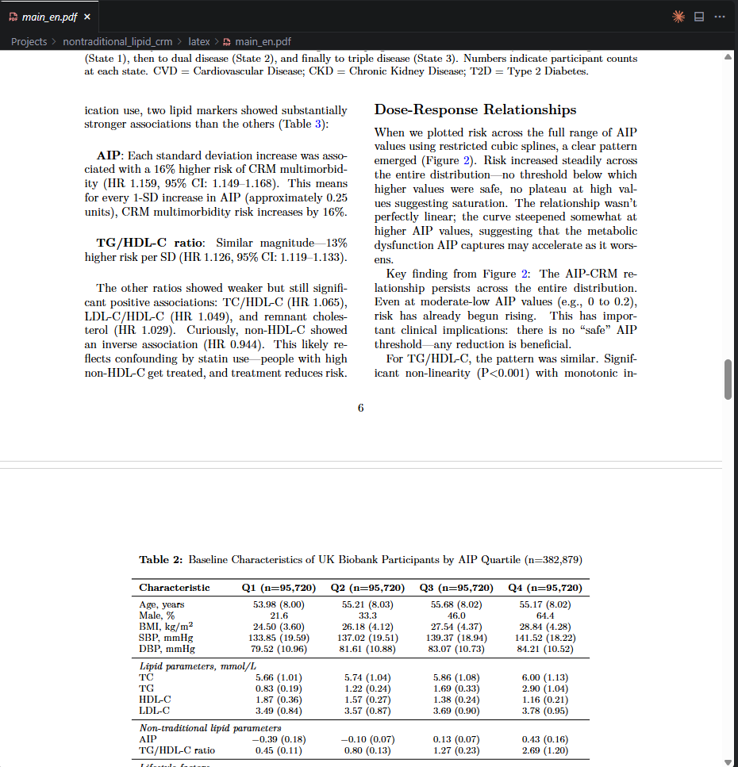

# Prometheus Research Skill

> 全自主科研智能体 - 后台执行，日志监控

**原创作者: xingye**
**微信: xingye4088**

---

## 原创声明

本项目为 **xingye** 独立开发的原创作品，享有完整版权。

- 版权所有 (c) 2026 xingye
- 未经作者书面授权，禁止用于商业用途
- 学术使用请保留作者署名

引用请注明：
```bibtex
@software{prometheus_research_2026,
  author = {xingye},
  title = {Prometheus Research Skill - 全自主科研智能体},
  year = {2026},
  url = {https://github.com/xingxingxingxin/prometheus-research-skill}
}
```

---

## 能力展示
这些是产出的论文初稿截图









---

## 工作原理

此 Skill 会在**后台**执行所有研究任务，用户通过日志监控进度。

```
用户说"启动研究" → Skill 启动后台进程 → 用户查看日志 → 完成输出
```

**重要**: Skill 不会在对话中执行任务，而是启动独立的 Python 后台进程。

---

## 使用方法

### 在 Claude Code 中使用

只需说：

```
启动研究 [你的研究主题]
```

例如：
```
启动研究 基于图神经网络的社交推荐系统
```

Skill 会自动：
1. 初始化项目结构
2. 启动后台执行进程
3. 告诉你如何监控进度

### 查看进度

```powershell
# Windows PowerShell - 实时查看日志
Get-Content Logs\executor.log -Wait -Tail 50

# Linux/Mac - 实时查看日志
tail -f Logs/executor.log
```

---

## 手动执行（可选）

如果需要手动控制：

```bash
# 1. 初始化项目
python scripts/start_research.py --topic "你的研究主题"

# 2. 启动后台执行 (Windows)
start /b pythonw scripts/automation/task_executor.py --loop >> Logs/executor.log 2>&1

# 2. 启动后台执行 (Linux/Mac)
nohup python scripts/automation/task_executor.py --loop >> Logs/executor.log 2>&1 &

# 3. 查看日志
Get-Content Logs\executor.log -Wait -Tail 50   # Windows
tail -f Logs/executor.log                      # Linux/Mac
```

---

## 输出

研究完成后，在 `Projects/{研究主题}/output/` 生成：

```
output/
├── paper_en.pdf        # 英文论文
├── paper_zh.pdf        # 中文论文
└── supplementary.zip   # 代码和数据
```

---

## 10 阶段 100 任务

| Phase | 名称 | 任务数 | 说明 |
|-------|------|--------|------|
| 0 | Topic | 4 | 主题分析 |
| 1 | Literature | 34 | 文献综述 |
| 2 | Hypothesis | 6 | 假设设计 |
| 3 | Coding | 7 | 代码实现 |
| 4 | Execution | 6 | 实验执行 |
| 5 | Analysis | 5 | 结果分析 |
| 6 | Writing | 9 | 论文撰写 |
| 7 | Humanization | 9 | 去AI化润色 |
| 8 | LaTeX | 12 | LaTeX排版 |
| 9 | Review | 8 | 同行评审 |

---

## 安装

```bash
git clone https://github.com/xingxingxingxin/prometheus-research-skill.git
cd prometheus-research-skill
pip install -r scripts/requirements.txt
```

---

## 目录结构

```
prometheus-research-skill/
├── SKILL.md                    # Claude Code Skill 定义
├── README.md
├── assets/                     # 展示图片
├── config/
│   └── execution_config.yaml   # 执行配置
├── scripts/
│   ├── start_research.py       # 启动研究
│   ├── automation/
│   │   └── task_executor.py    # 后台任务执行器
│   ├── Core/                   # 核心模块
│   │   ├── prompts/            # 阶段提示词
│   │   ├── gep/                # GEP 错误恢复
│   │   └── tools/              # 科研工具
│   └── requirements.txt
├── Projects/                   # 项目目录（运行时生成）
└── Logs/                       # 日志目录（运行时生成）
```

---

## 联系方式

- **作者**: xingye
- **微信**: xingye4088
- **GitHub**: https://github.com/xingxingxingxin

---

*版权所有 (c) 2026 xingye*
